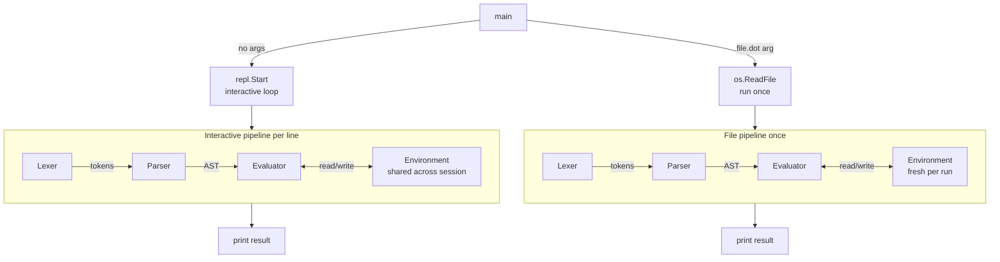

# Learn Interpreter

A simple interpreter built from scratch in Go for educational purposes. The interpreted language supports variable bindings, arithmetic expressions, functions (with closures), conditionals, loops, strings, and console/file I/O.

## Architecture

An interpreter reads source code as text and executes it directly, without producing a standalone binary. This interpreter follows the classic three-stage pipeline, backed by an environment that tracks runtime state:




1. **REPL** -- Entry point. Runs an interactive loop (no args) or executes a `.dot` file (file path arg).
2. **Lexer** -- Scans raw source text character by character and produces a stream of tokens.
3. **Parser** -- Consumes tokens, validates syntax, and builds an Abstract Syntax Tree (AST).
4. **Evaluator** -- Walks the AST recursively and executes each node.
5. **Environment** -- A chain of scopes that stores variable and function bindings at runtime.

## Getting Started

**Prerequisites:** Go 1.21 or later.

```bash
git clone https://github.com/TheTangentLine/Learn_interpreter.git
cd Learn_interpreter
make build          # compiles to bin/dot
```


| Goal                | Command                                 |
| ------------------- | --------------------------------------- |
| Start the REPL      | `make run` or `./bin/dot`               |
| Run a `.dot` file   | `./bin/dot examples/recursion_test.dot` |
| Run all tests       | `make test`                             |
| Run tests (verbose) | `make test-verbose`                     |


## REPL

Run interactively with no arguments:

```
make run
>> let x = 10
>> x + 5
15
```

Run a `.dot` source file:

```
./bin/dot program.dot
```

The two modes share the same Lexer → Parser → Evaluator pipeline. The difference is that interactive mode preserves its `Environment` across inputs (so bindings persist between lines), while file mode creates a fresh environment and exits after one run.

## Language Features


| Feature               | Example                                      |
| --------------------- | -------------------------------------------- |
| Variable binding      | `let x = 10;`                                |
| Variable reassignment | `x = 42;`                                    |
| Arithmetic            | `x + 2 * 3`                                  |
| Boolean logic         | `if (x > 5) { "big" } else { "small" }`      |
| Functions & closures  | `let add = fn(a, b) { a + b };`              |
| Return statements     | `return x + y;`                              |
| String values         | `"hello" + " world"`                         |
| For loops             | `for (let i = 0; i < 10; i = i + 1) { ... }` |


## Difficulty Levels for building each component

```
10 │
 9 │                                                      ████
 8 │                                                      ████
 7 │                                                      ████
 6 │                                              ████    ████
 5 │                                              ████    ████
 4 │                       ████   ████    ████    ████    ████
 3 │          ████   ████  ████   ████    ████    ████    ████
 2 │  ████    ████   ████  ████   ████    ████    ████    ████
 1 │  ████    ████   ████  ████   ████    ████    ████    ████
   └────────────────────────────────────────────────────────────
     REPL    Token   Lexer  AST   Env   Object   Eval   Parser
```


| **Component** | **Difficulty** | **Why**                                                                                                                                                                         |
| ------------- | -------------- | ------------------------------------------------------------------------------------------------------------------------------------------------------------------------------- |
| Token         | 1/10           | Just constants and a struct. Pure definitions, zero logic.                                                                                                                      |
| REPL          | 2/10           | Mostly wiring together components that already exist. The one non-obvious part: the `Environment` must live outside the loop so bindings persist across inputs.                 |
| Lexer         | 3/10           | Character-by-character state machine. Repetitive but straightforward. One tricky part: two-char operators (`==`, `!=`).                                                         |
| AST           | 3/10           | Mostly struct definitions and interfaces. The tricky part is designing the right node hierarchy upfront.                                                                        |
| Environment   | 4/10           | A hash map with a linked outer pointer. The concept of scope chaining is simple once you see it drawn out.                                                                      |
| Object Types  | 4/10           | Defining the runtime value system. Mostly boilerplate, but you need to understand *why* `ReturnValue` and `Error` need to be objects.                                           |
| Evaluator     | 6/10           | Moderate. The tree-walking dispatch is clean, but closures and return value propagation require careful thinking. Easy to get subtly wrong.                                     |
| Parser        | 9/10           | The hardest component by far. Pratt parsing is a paradigm shift -- the `parseExpression(precedence)` loop is unintuitive until it clicks. Debugging precedence bugs is painful. |


## Documentation

Detailed write-ups on how each component works:


| Topic                             | Document                                                   |
| --------------------------------- | ---------------------------------------------------------- |
| Compiled vs Interpreted Languages | [docs/pattern/mechanism.md](docs/pattern/mechanism.md)     |
| Tokens                            | [docs/lexer/token.md](docs/lexer/token.md)                 |
| Lexer                             | [docs/lexer/lexer.md](docs/lexer/lexer.md)                 |
| Abstract Syntax Tree              | [docs/parser/ast.md](docs/parser/ast.md)                   |
| Parser                            | [docs/parser/parser.md](docs/parser/parser.md)             |
| Evaluator                         | [docs/evaluator/evaluator.md](docs/evaluator/evaluator.md) |
| Environment / Storage             | [docs/environment/storage.md](docs/environment/storage.md) |
| Object Types                      | [docs/environment/types.md](docs/environment/types.md)     |
| REPL & Entry Point                | [docs/repl/repl.md](docs/repl/repl.md)                     |


## Project Structure

```
Learn_interpreter/
├── cmd/
│   └── dot/             # Entry point -- starts the REPL or runs a file
├── internal/
│   ├── token/           # Token type definitions and keyword lookup table
│   ├── lexer/           # Character scanner that produces tokens
│   ├── ast/             # AST node interfaces and concrete node types
│   ├── parser/          # Pratt parser that builds the AST from tokens
│   ├── object/          # Runtime value types and environment (scope chain)
│   ├── evaluator/       # Tree-walking evaluator that executes the AST
│   └── repl/            # Read-Eval-Print Loop for interactive use
├── examples/            # Sample programs written in the language
├── docs/                # The documentation you are reading now
├── go.mod
├── Makefile
└── README.md
```

