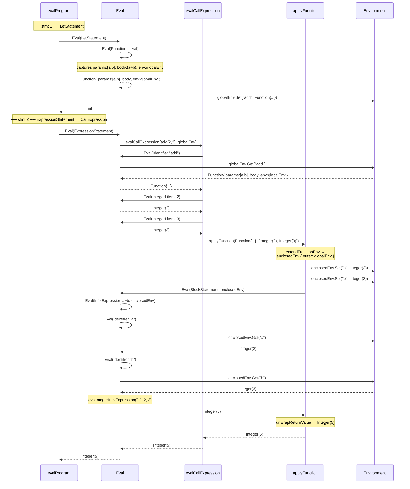

# Evaluator

## Role

The evaluator is the final stage of the interpreter pipeline. It takes the **AST** produced by the parser and **executes** it. This is where the program actually *runs* -- arithmetic is computed, variables are bound, functions are called, and results are produced.

Our evaluator uses the **tree-walking** strategy: it starts at the root of the AST and recursively visits every node, computing a result for each one. There is no compilation to bytecode, no virtual machine. We walk the tree directly.

## The Eval Function

The entire evaluator is driven by a single recursive function:

```go
func Eval(node ast.Node, env *object.Environment) object.Object
```

- **`node`** -- The AST node to evaluate.
- **`env`** -- The current environment (scope), where variable and function bindings are stored.
- **Returns** an `object.Object` -- the runtime value produced by evaluating the node.

`Eval` uses a type switch to decide what to do based on the kind of node:

```go
func Eval(node ast.Node, env *object.Environment) object.Object {
    switch node := node.(type) {

    // Statements
    case *ast.Program:
        return evalProgram(node, env)
    case *ast.ExpressionStatement:
        return Eval(node.Expression, env)
    case *ast.BlockStatement:
        return evalBlockStatement(node, env)
    case *ast.LetStatement:
        val := Eval(node.Value, env)
        if isError(val) { return val }
        env.Set(node.Name.Value, val)
    case *ast.ReturnStatement:
        val := Eval(node.ReturnValue, env)
        if isError(val) { return val }
        return &object.ReturnValue{Value: val}

    // Expressions
    case *ast.IntegerLiteral:
        return &object.Integer{Value: node.Value}
    case *ast.StringLiteral:
        return &object.String{Value: node.Value}
    case *ast.Boolean:
        return nativeBoolToBooleanObject(node.Value)
    case *ast.PrefixExpression:
        right := Eval(node.Right, env)
        if isError(right) { return right }
        return evalPrefixExpression(node.Operator, right)
    case *ast.InfixExpression:
        left := Eval(node.Left, env)
        if isError(left) { return left }
        right := Eval(node.Right, env)
        if isError(right) { return right }
        return evalInfixExpression(node.Operator, left, right)
    case *ast.IfExpression:
        return evalIfExpression(node, env)
    case *ast.Identifier:
        return evalIdentifier(node, env)
    case *ast.FunctionLiteral:
        return &object.Function{Parameters: node.Parameters, Body: node.Body, Env: env}
    case *ast.CallExpression:
        return evalCallExpression(node, env)
    }
    return nil
}
```

Every case follows the same pattern: evaluate sub-expressions first, check for errors, then combine the results.

## Evaluating Each Node Type

### Literals (Integer, String, Boolean)

The simplest cases. The node already holds the value; we just wrap it in a runtime object:

```go
case *ast.IntegerLiteral:
    return &object.Integer{Value: node.Value}   // node.Value is int64

case *ast.StringLiteral:
    return &object.String{Value: node.Value}     // node.Value is string

case *ast.Boolean:
    return nativeBoolToBooleanObject(node.Value) // returns singleton TRUE or FALSE
```

For booleans, we reuse two global singleton objects (`TRUE` and `FALSE`) instead of allocating a new object each time. Since there are only two boolean values, this saves memory and allows pointer comparison.

### Prefix Expressions (`-x`, `!x`)

Evaluate the operand first, then apply the operator:

```go
func evalPrefixExpression(operator string, right object.Object) object.Object {
    switch operator {
    case "!":
        return evalBangOperatorExpression(right)
    case "-":
        return evalMinusPrefixOperatorExpression(right)
    default:
        return newError("unknown operator: %s%s", operator, right.Type())
    }
}
```

- **`!`** flips truthiness: `!true` → `false`, `!false` → `true`, `!0` → `true` (if we treat 0 as falsy), `!5` → `false`.
- **`-`** negates an integer: `-5` → `-5`. If the operand is not an integer, it is an error.

### Infix Expressions (`a + b`, `a == b`)

Evaluate both sides, then combine:

```go
func evalInfixExpression(operator string, left, right object.Object) object.Object {
    switch {
    case left.Type() == object.INTEGER_OBJ && right.Type() == object.INTEGER_OBJ:
        return evalIntegerInfixExpression(operator, left, right)
    case left.Type() == object.STRING_OBJ && right.Type() == object.STRING_OBJ:
        return evalStringInfixExpression(operator, left, right)
    case operator == "==":
        return nativeBoolToBooleanObject(left == right)
    case operator == "!=":
        return nativeBoolToBooleanObject(left != right)
    default:
        return newError("unknown operator: %s %s %s", left.Type(), operator, right.Type())
    }
}
```

For integers, arithmetic and comparison are straightforward:

```go
func evalIntegerInfixExpression(operator string, left, right object.Object) object.Object {
    leftVal := left.(*object.Integer).Value
    rightVal := right.(*object.Integer).Value
    switch operator {
    case "+":  return &object.Integer{Value: leftVal + rightVal}
    case "-":  return &object.Integer{Value: leftVal - rightVal}
    case "*":  return &object.Integer{Value: leftVal * rightVal}
    case "/":  return &object.Integer{Value: leftVal / rightVal}
    case "<":  return nativeBoolToBooleanObject(leftVal < rightVal)
    case ">":  return nativeBoolToBooleanObject(leftVal > rightVal)
    case "==": return nativeBoolToBooleanObject(leftVal == rightVal)
    case "!=": return nativeBoolToBooleanObject(leftVal != rightVal)
    default:   return newError("unknown operator: %s %s %s", left.Type(), operator, right.Type())
    }
}
```

For strings, `+` means concatenation: `"hello" + " world"` → `"hello world"`.

### If Expressions

Evaluate the condition. If it is truthy, evaluate the consequence; otherwise evaluate the alternative (if it exists):

```go
func evalIfExpression(ie *ast.IfExpression, env *object.Environment) object.Object {
    condition := Eval(ie.Condition, env)
    if isError(condition) { return condition }

    if isTruthy(condition) {
        return Eval(ie.Consequence, env)
    } else if ie.Alternative != nil {
        return Eval(ie.Alternative, env)
    } else {
        return NULL
    }
}
```

**Truthiness rules:** `false` and `null` are falsy. Everything else (including `0`) is truthy.

### Identifiers (Variable Lookup)

When we encounter a name like `x`, we look it up in the environment:

```go
func evalIdentifier(node *ast.Identifier, env *object.Environment) object.Object {
    val, ok := env.Get(node.Value)
    if !ok {
        return newError("identifier not found: " + node.Value)
    }
    return val
}
```

The environment's `Get` method searches the current scope first, then walks up the chain of outer scopes (see [storage.md](../environment/storage.md)).

### Let Statements (Variable Binding)

Evaluate the right-hand side, then store the result in the environment under the given name:

```go
case *ast.LetStatement:
    val := Eval(node.Value, env)
    if isError(val) { return val }
    env.Set(node.Name.Value, val)
```

After `let x = 5;`, calling `env.Get("x")` returns `Integer(5)`.

### Function Literals (Creating Closures)

A function literal does **not** execute its body. Instead, it captures three things and wraps them into a `Function` object:

```go
case *ast.FunctionLiteral:
    return &object.Function{
        Parameters: node.Parameters,
        Body:       node.Body,
        Env:        env,  // capture the current environment
    }
```

The captured `env` is critical -- it is what makes **closures** work. When the function is eventually called, it will see variables from the scope where it was *defined*, not just the scope where it is *called*.

### Call Expressions (Invoking Functions)

This is the most complex evaluation step. It involves:

1. **Evaluate the function** -- the thing being called might be an identifier (`add`) or a literal (`fn(x){x}`).
2. **Evaluate the arguments** -- each argument is an expression that must be evaluated to a value.
3. **Create a new scope** -- extend the function's closure environment with parameter bindings.
4. **Evaluate the body** -- run the function's block statement in the new scope.

```go
func evalCallExpression(node *ast.CallExpression, env *object.Environment) object.Object {
    function := Eval(node.Function, env)
    if isError(function) { return function }

    args := evalExpressions(node.Arguments, env)
    if len(args) == 1 && isError(args[0]) { return args[0] }

    return applyFunction(function, args)
}

func applyFunction(fn object.Object, args []object.Object) object.Object {
    function, ok := fn.(*object.Function)
    if !ok {
        return newError("not a function: %s", fn.Type())
    }

    extendedEnv := extendFunctionEnv(function, args)
    evaluated := Eval(function.Body, extendedEnv)
    return unwrapReturnValue(evaluated)
}

func extendFunctionEnv(fn *object.Function, args []object.Object) *object.Environment {
    env := object.NewEnclosedEnvironment(fn.Env) // new scope, outer = closure env
    for i, param := range fn.Parameters {
        env.Set(param.Value, args[i]) // bind parameter names to argument values
    }
    return env
}
```

Key detail: the new environment's **outer pointer** points to `fn.Env` (the environment captured when the function was defined), **not** to the caller's environment. This is what gives us lexical scoping and closures.

### Return Statements

A return value is wrapped in a special `ReturnValue` object. As the evaluator unwinds through block statements, it checks for this wrapper and stops evaluating further statements:

```go
case *ast.ReturnStatement:
    val := Eval(node.ReturnValue, env)
    if isError(val) { return val }
    return &object.ReturnValue{Value: val}
```

When a `ReturnValue` bubbles up to `applyFunction`, it is unwrapped to produce the actual return value:

```go
func unwrapReturnValue(obj object.Object) object.Object {
    if returnValue, ok := obj.(*object.ReturnValue); ok {
        return returnValue.Value
    }
    return obj
}
```

### Error Handling

Errors are also objects (`object.Error`). Once an error is created, it propagates upward through every `Eval` call -- each node type checks `isError` before continuing:

```go
func isError(obj object.Object) bool {
    return obj != nil && obj.Type() == object.ERROR_OBJ
}
```

This gives us simple but effective error propagation without Go's `panic`/`recover`.

## Worked Example

Source code:

```
let add = fn(a, b) { a + b };
add(2, 3);
```

### Trace



**Result: `Integer(5)`**

## Key Takeaways

- The evaluator is a **recursive function** that dispatches on node type. Each node type has simple, predictable evaluation logic.
- **Closures** work because function objects capture their defining environment, and calls extend that environment (not the caller's).
- **Errors** and **return values** are wrapped in special objects that propagate upward through the recursion, stopping evaluation where appropriate.
- The tree-walking approach is simple to implement and understand. It is slower than bytecode compilation, but for an educational interpreter it is the clearest way to see how execution works.
