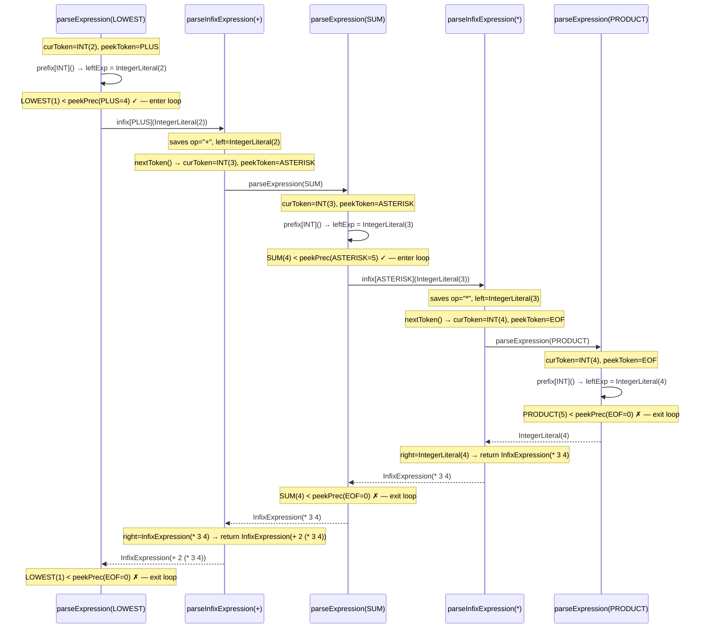
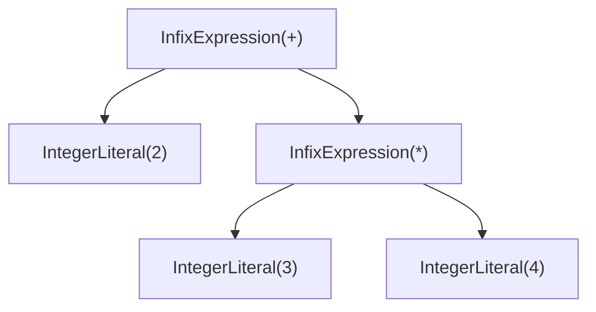
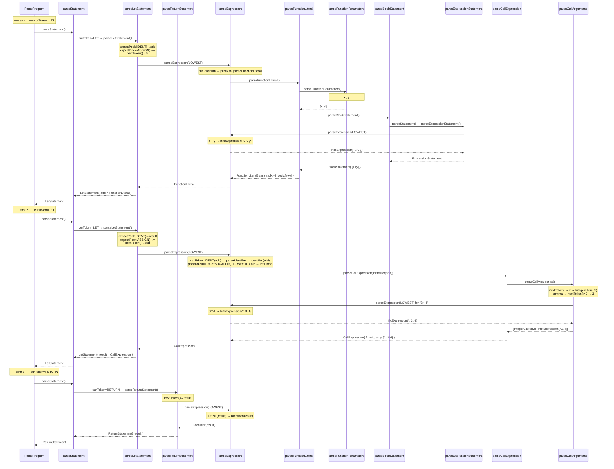
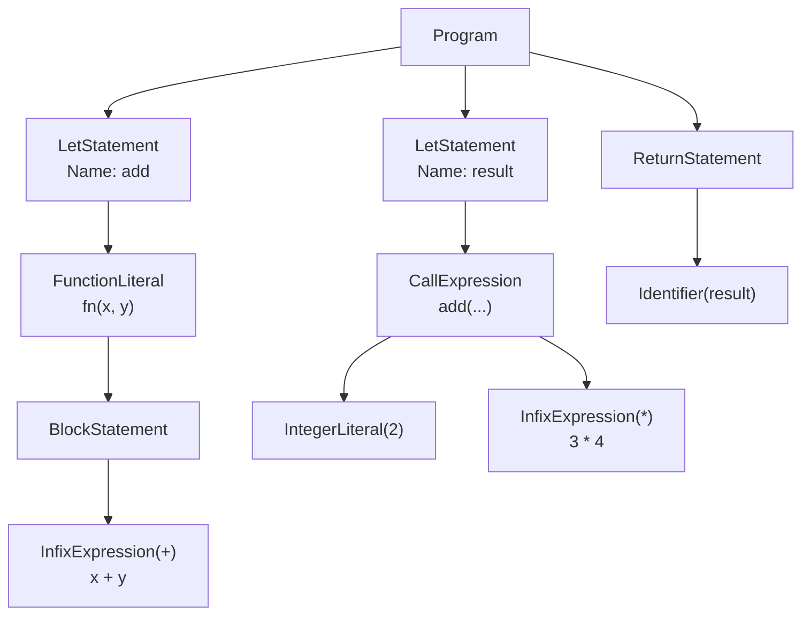

# Parser

## Role

The parser is the second stage of the interpreter pipeline. It takes the **flat stream of tokens** produced by the lexer and builds an **Abstract Syntax Tree** (AST) that captures the structure, nesting, and operator precedence of the source code.

If the tokens do not form a valid program according to the language's grammar, the parser reports syntax errors.

## The Parser Struct

```go
type Parser struct {
    l         *lexer.Lexer
    curToken  token.Token // the current token being examined
    peekToken token.Token // the next token (one ahead)
    errors    []string

    prefixParseFns map[token.TokenType]prefixParseFn
    infixParseFns  map[token.TokenType]infixParseFn
}
```

- **`l`** -- A pointer to the lexer. The parser calls `l.NextToken()` to consume tokens.
- **`curToken`** / **`peekToken`** -- A two-token lookahead. At any point, `curToken` is the token we are currently deciding what to do with, and `peekToken` is the one that comes next. This lets us make decisions based on what follows.
- **`errors`** -- Accumulated parse error messages.
- **`prefixParseFns`** / **`infixParseFns`** -- Maps from token type to parsing functions (explained below).

### Advancing Tokens

```go
func (p *Parser) nextToken() {
    p.curToken = p.peekToken
    p.peekToken = p.l.NextToken()
}
```

Each call shifts the window forward by one token. What was `peekToken` becomes `curToken`, and a fresh token is read from the lexer into `peekToken`.

## Parsing Approach: Pratt Parsing

This parser uses **Pratt parsing** (also called *top-down operator precedence parsing*), invented by Vaughan Pratt in 1973. It is elegant, easy to extend, and handles operator precedence without needing a complex grammar specification.

The core ideas:

1. **Every token type can have a prefix parse function and/or an infix parse function** associated with it.
2. **Every infix operator has a precedence level** (a number). Higher numbers bind tighter.
3. The main `parseExpression` function uses these two pieces of information to build the correct tree shape.

### Precedence Levels

Precedence determines which operator "wins" when two operators compete for the same operand. We define them as increasing integer constants:

```go
const (
    _ int = iota
    LOWEST
    EQUALS      // ==, !=
    LESSGREATER  // <, >
    SUM         // +, -
    PRODUCT     // *, /
    PREFIX      // -x, !x
    CALL        // myFunc(x)
)
```

And a lookup table maps token types to their precedence:

```go
var precedences = map[token.TokenType]int{
    token.EQ:       EQUALS,
    token.NOT_EQ:   EQUALS,
    token.LT:       LESSGREATER,
    token.GT:       LESSGREATER,
    token.PLUS:     SUM,
    token.MINUS:    SUM,
    token.ASTERISK: PRODUCT,
    token.SLASH:    PRODUCT,
    token.LPAREN:   CALL,
}
```

`*` and `/` have precedence `PRODUCT` (5), while `+` and `-` have precedence `SUM` (4). Since 5 > 4, multiplication binds tighter than addition. This is how `2 + 3 * 4` becomes `2 + (3 * 4)` rather than `(2 + 3) * 4`.

### Parse Function Types

```go
type prefixParseFn func() ast.Expression
type infixParseFn  func(ast.Expression) ast.Expression
```

- A **prefix parse function** handles a token that appears at the *start* of an expression. It takes no arguments because there is nothing to its left. Examples: integer literals, identifiers, `!`, unary `-`, `if`, `fn`, grouped `(`.
- An **infix parse function** handles a token that appears *between* two expressions. It receives the already-parsed left-hand side as an argument. Examples: `+`, `-`, `*`, `/`, `==`, `!=`, `<`, `>`, and function call `(`.

During initialization, the parser registers these functions:

```go
// Prefix
p.registerPrefix(token.IDENT, p.parseIdentifier)
p.registerPrefix(token.INT, p.parseIntegerLiteral)
p.registerPrefix(token.STRING, p.parseStringLiteral)
p.registerPrefix(token.TRUE, p.parseBoolean)
p.registerPrefix(token.FALSE, p.parseBoolean)
p.registerPrefix(token.BANG, p.parsePrefixExpression)
p.registerPrefix(token.MINUS, p.parsePrefixExpression)
p.registerPrefix(token.LPAREN, p.parseGroupedExpression)
p.registerPrefix(token.IF, p.parseIfExpression)
p.registerPrefix(token.FUNCTION, p.parseFunctionLiteral)

// Infix
p.registerInfix(token.PLUS, p.parseInfixExpression)
p.registerInfix(token.MINUS, p.parseInfixExpression)
p.registerInfix(token.ASTERISK, p.parseInfixExpression)
p.registerInfix(token.SLASH, p.parseInfixExpression)
p.registerInfix(token.EQ, p.parseInfixExpression)
p.registerInfix(token.NOT_EQ, p.parseInfixExpression)
p.registerInfix(token.LT, p.parseInfixExpression)
p.registerInfix(token.GT, p.parseInfixExpression)
p.registerInfix(token.LPAREN, p.parseCallExpression)
```

Notice `LPAREN` appears in both maps. As a prefix, it starts a grouped expression `(expr)`. As an infix, it starts a function call `func(args)`.

## The Core Algorithm: parseExpression

This single function is the heart of Pratt parsing:

```go
func (p *Parser) parseExpression(precedence int) ast.Expression {
    // Step 1: find the prefix parse function for the current token
    prefix := p.prefixParseFns[p.curToken.Type]
    if prefix == nil {
        p.noPrefixParseFnError(p.curToken.Type)
        return nil
    }

    // Step 2: call it to parse the "left" side of the expression
    leftExp := prefix()

    // Step 3: as long as the next token is an infix operator with higher
    //         precedence than our current level, keep wrapping
    for precedence < p.peekPrecedence() {
        infix := p.infixParseFns[p.peekToken.Type]
        if infix == nil {
            return leftExp
        }
        p.nextToken()
        leftExp = infix(leftExp) // leftExp becomes the left child of the new node
    }

    return leftExp
}
```

Let's break this down:

1. **Find the prefix function.** Based on `curToken.Type`, look up the function that knows how to start an expression with this token. For an `INT` token, that's `parseIntegerLiteral`. For a `MINUS` token, that's `parsePrefixExpression`.

2. **Call it.** This returns the initial left-hand expression. For a simple integer like `3`, this is just an `IntegerLiteral` node.

3. **The infix loop.** Now we check: does the *next* token have a higher precedence than the `precedence` parameter we were called with? If yes, that operator should "steal" our expression as its left operand. We advance, call the infix function (passing the current `leftExp` as the left child), and the result becomes the new `leftExp`. We keep looping until we hit something with equal or lower precedence.

This loop is what makes precedence work. When we are inside a `*` parse (high precedence), the loop stops at `+` (lower precedence), so `*` gets to keep its operands. But when we are inside a `+` parse (lower precedence), the loop *continues* into `*`, letting multiplication group its operands first.

## Worked Example: Parsing `2 + 3 * 4`

Tokens: `INT(2)  PLUS  INT(3)  ASTERISK  INT(4)  EOF`

### Call stack trace



### Final AST



Multiplication is deeper in the tree, so it executes first. The result is `2 + 12 = 14`.

## Parsing Statements

Not everything is an expression. Statements are parsed by checking the current token:

```go
func (p *Parser) parseStatement() ast.Statement {
    switch p.curToken.Type {
    case token.LET:
        return p.parseLetStatement()
    case token.RETURN:
        return p.parseReturnStatement()
    default:
        return p.parseExpressionStatement()
    }
}
```

The three paths produce different AST node types:

| `curToken` | Function called | AST node produced |
|---|---|---|
| `LET` | `parseLetStatement` | `*ast.LetStatement` |
| `RETURN` | `parseReturnStatement` | `*ast.ReturnStatement` |
| anything else | `parseExpressionStatement` | `*ast.ExpressionStatement` |

### parseLetStatement

Expects the pattern `let <identifier> = <expression>;`:

```go
func (p *Parser) parseLetStatement() *ast.LetStatement {
    stmt := &ast.LetStatement{Token: p.curToken}

    p.expectPeek(token.IDENT)           // advance, expect identifier
    stmt.Name = &ast.Identifier{Token: p.curToken, Value: p.curToken.Literal}

    p.expectPeek(token.ASSIGN)          // advance, expect =

    p.nextToken()
    stmt.Value = p.parseExpression(LOWEST) // parse the right-hand side

    if p.peekToken.Type == token.SEMICOLON {
        p.nextToken()                   // consume optional semicolon
    }
    return stmt
}
```

### parseReturnStatement

`return` is simpler than `let` — just the keyword followed by an expression:

```go
func (p *Parser) parseReturnStatement() ast.Statement {
    stmt := &ast.ReturnStatement{Token: p.curToken}
    p.nextToken()
    stmt.ReturnValue = p.parseExpression(LOWEST)
    if p.peekToken.Type == token.SEMICOLON {
        p.nextToken()
    }
    return stmt
}
```

After consuming `return`, the parser advances one token and delegates to `parseExpression`. Any valid expression is legal after `return`.

### parseExpressionStatement

Anything that is not `let` or `return` falls through as an expression-used-as-a-statement. A bare function call like `add(2, 3)` or a standalone arithmetic expression like `5 * 10` is parsed this way. The trailing semicolon is optional:

```go
func (p *Parser) parseExpressionStatement() *ast.ExpressionStatement {
    stmt := &ast.ExpressionStatement{Token: p.curToken}
    stmt.Expression = p.parseExpression(LOWEST)
    if p.peekToken.Type == token.SEMICOLON {
        p.nextToken()
    }
    return stmt
}
```

### parseBlockStatement

Block statements appear inside `if` bodies, `else` bodies, and function bodies. A block is structurally identical to a program — a sequence of statements — except it stops at `}` instead of EOF:

```go
func (p *Parser) parseBlockStatement() *ast.BlockStatement {
    block := &ast.BlockStatement{Token: p.curToken}
    p.nextToken() // move past {
    for p.curToken.Type != token.RBRACE && p.curToken.Type != token.EOF {
        stmt := p.parseStatement()
        if stmt != nil {
            block.Statements = append(block.Statements, stmt)
        }
        p.nextToken()
    }
    return block
}
```

### The Top-Level Loop

The parser's entry point repeatedly parses statements until EOF:

```go
func (p *Parser) ParseProgram() *ast.Program {
    program := &ast.Program{}
    for p.curToken.Type != token.EOF {
        stmt := p.parseStatement()
        if stmt != nil {
            program.Statements = append(program.Statements, stmt)
        }
        p.nextToken()
    }
    return program
}
```

## Parsing Complex Expressions

Some prefix parse functions are more involved than a single token. These handle the language's compound expressions.

### parseIfExpression

`if` is parsed as an **expression**, not a statement. This means it can appear anywhere an expression is valid — on the right-hand side of `let`, as a function argument, etc. The grammar is:

```
if ( <condition> ) { <consequence> } [ else { <alternative> } ]
```

```go
func (p *Parser) parseIfExpression() ast.Expression {
    expr := &ast.IfExpression{Token: p.curToken}

    if !p.expectPeek(token.LPAREN) { return nil }
    p.nextToken()
    expr.Condition = p.parseExpression(LOWEST)

    if !p.expectPeek(token.RPAREN) { return nil }
    if !p.expectPeek(token.LBRACE) { return nil }
    expr.Consequence = p.parseBlockStatement()

    if p.peekToken.Type == token.ELSE {
        p.nextToken()
        if !p.expectPeek(token.LBRACE) { return nil }
        expr.Alternative = p.parseBlockStatement()
    }

    return expr
}
```

`expectPeek` advances only if the next token matches the expected type; otherwise it appends an error and returns `false`. This is how the parser enforces required punctuation without hard-coded panics. `Alternative` is `nil` when there is no `else` branch.

### parseFunctionLiteral

Function literals follow the grammar `fn ( <params> ) { <body> }`. Both the parameter list and the body are parsed by dedicated helpers:

```go
func (p *Parser) parseFunctionLiteral() ast.Expression {
    lit := &ast.FunctionLiteral{Token: p.curToken}

    if !p.expectPeek(token.LPAREN) { return nil }
    lit.Parameters = p.parseFunctionParameters()

    if !p.expectPeek(token.LBRACE) { return nil }
    lit.Body = p.parseBlockStatement()

    return lit
}
```

`parseFunctionParameters` handles the comma-separated identifier list:

```go
func (p *Parser) parseFunctionParameters() []*ast.Identifier {
    var identifiers []*ast.Identifier
    if p.peekToken.Type == token.RPAREN {
        p.nextToken()            // empty parameter list: fn() { ... }
        return identifiers
    }
    p.nextToken()
    identifiers = append(identifiers, &ast.Identifier{Token: p.curToken, Value: p.curToken.Literal})
    for p.peekToken.Type == token.COMMA {
        p.nextToken(); p.nextToken()
        identifiers = append(identifiers, &ast.Identifier{Token: p.curToken, Value: p.curToken.Literal})
    }
    if !p.expectPeek(token.RPAREN) { return nil }
    return identifiers
}
```

### parseCallExpression

Function calls are parsed as **infix** expressions. When the parser finishes parsing an expression and sees `(` as the next token, the infix parse function for `LPAREN` fires — `parseCallExpression`:

```go
func (p *Parser) parseCallExpression(left ast.Expression) ast.Expression {
    call := &ast.CallExpression{Token: p.curToken, Function: left}
    call.Arguments = p.parseCallArguments()
    return call
}
```

`left` is whatever was just parsed — an identifier like `add`, or even a function literal `fn(x) { x }`. This is what allows immediate invocation: `fn(x) { x }(42)`.

`parseCallArguments` collects a comma-separated list of full expressions, each parsed at `LOWEST` precedence so they can contain their own operators:

```go
func (p *Parser) parseCallArguments() []ast.Expression {
    var args []ast.Expression
    if p.peekToken.Type == token.RPAREN {
        p.nextToken()
        return args
    }
    p.nextToken()
    args = append(args, p.parseExpression(LOWEST))
    for p.peekToken.Type == token.COMMA {
        p.nextToken(); p.nextToken()
        args = append(args, p.parseExpression(LOWEST))
    }
    if !p.expectPeek(token.RPAREN) { return nil }
    return args
}
```

## Worked Example: A Complete Program

Input:

```
let add = fn(x, y) { x + y; };
let result = add(2, 3 * 4);
return result;
```

`ParseProgram` loops three times, once per statement.



### Resulting AST



The evaluator walks this tree top-down: it binds `add` to the function object, calls it with `2` and `12` (the result of `3 * 4`), binds `result` to `14`, then returns `14`.

## Key Takeaways

- **Pratt parsing** makes precedence easy: each infix operator has a numeric precedence, and the recursive `parseExpression` loop uses it to decide whether to keep grouping or to stop and return.
- **Prefix and infix parse functions** are registered per token type, making the parser easy to extend -- adding a new operator is just registering a new function with the right precedence.
- **Two-token lookahead** (`curToken` and `peekToken`) is enough to parse the entire language without backtracking.
- The parser produces an AST that the evaluator can walk. The parser itself never executes anything.
