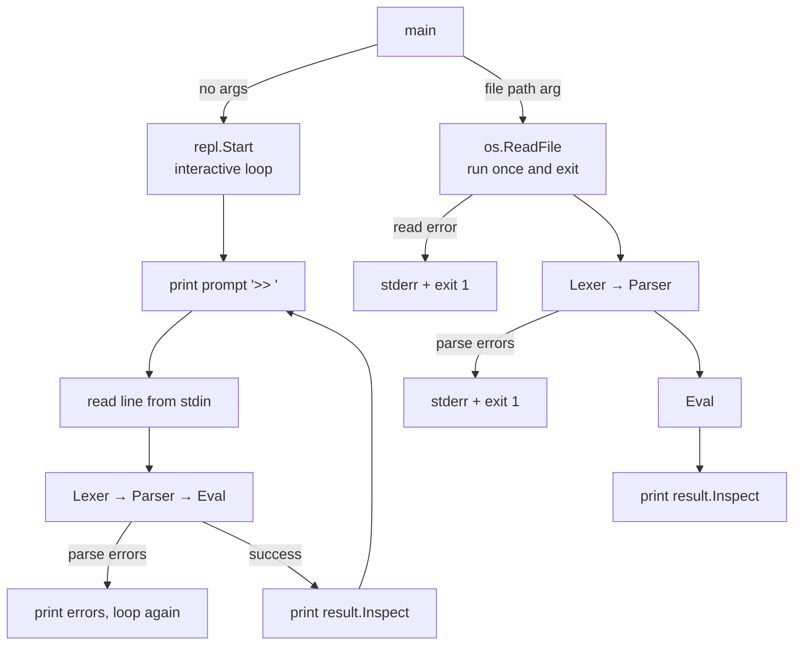
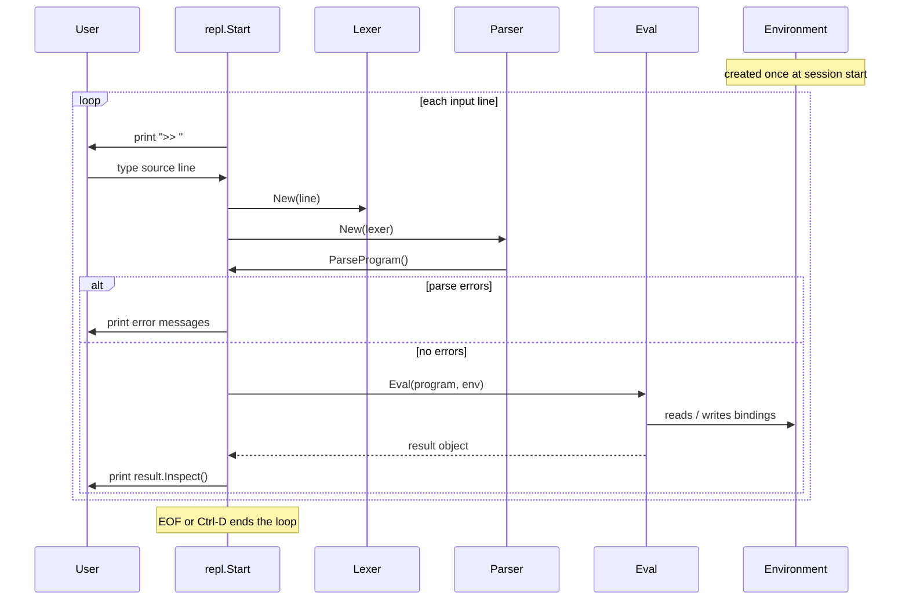
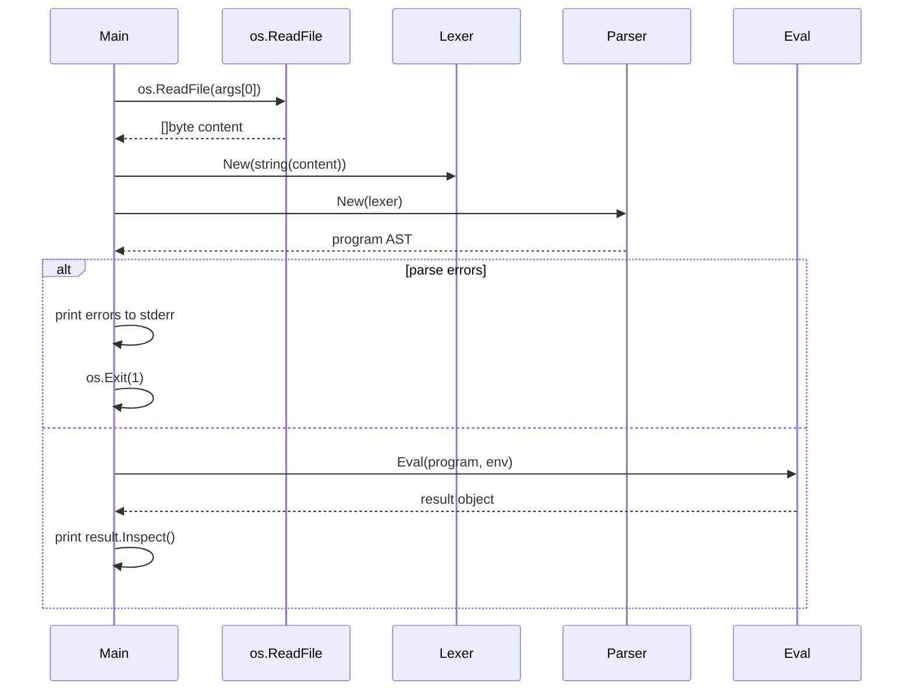
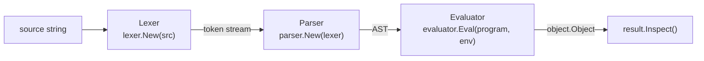

# REPL

## Role

The REPL (Read-Eval-Print Loop) is the **interactive entry point** for the interpreter. Its sole job is to read lines from stdin, run each one through the pipeline, and print the result — in a loop.

File execution is handled entirely by `main`, which reads the file with `os.ReadFile` and runs the pipeline once. The `repl` package is not involved.

---

## Two Modes of Execution



---

## `repl.Start`

The `repl` package exposes a single function:

```go
func Start(in io.Reader, out io.Writer)
```

It accepts any `io.Reader` as input and any `io.Writer` as output, so it is easy to test or redirect. In production `main` passes `os.Stdin` and `os.Stdout`.

A **single environment** is created before the loop and shared across all inputs in the session — variables defined on one line are visible on the next.

```go
func Start(in io.Reader, out io.Writer) {
    scanner := bufio.NewScanner(in)
    env := object.NewEnvironment()  // shared across the whole session

    for {
        fmt.Fprint(out, prompt)     // print ">> "
        if !scanner.Scan() { break }

        line := scanner.Text()
        l := lexer.New(line)
        p := parser.New(l)
        program := p.ParseProgram()

        if len(p.Errors()) > 0 {
            for _, msg := range p.Errors() {
                fmt.Fprintf(out, "\t%s\n", msg)
            }
            continue   // skip eval, prompt again
        }

        result := evaluator.Eval(program, env)
        if result != nil {
            fmt.Fprintln(out, result.Inspect())
        }
    }
}
```

### Session lifecycle



Because `env` lives outside the loop, this session works as expected:

```
>> let x = 10
>> let y = 20
>> x + y
30
```

---

## File Mode (owned by `main`)

When a file path is provided, `main` handles everything directly — no `repl` package involved:



Errors in file mode exit the process immediately with a non-zero code, rather than being swallowed and looped past as in interactive mode.

---

## The Full Pipeline (both modes)

Both modes converge on the same three-stage pipeline:



| Stage     | Input          | Output          | Doc                                           |
|-----------|----------------|-----------------|-----------------------------------------------|
| Lexer     | source string  | token stream    | [lexer.md](../lexer/lexer.md)                 |
| Parser    | token stream   | AST             | [parser.md](../parser/parser.md)              |
| Evaluator | AST + env      | `object.Object` | [evaluator.md](../evaluator/evaluator.md)     |

---

## Key Takeaways

- The `repl` package is **only** responsible for the interactive loop. File I/O is `main`'s concern.
- `repl.Start` is a plain function — no struct, no state, just `(in, out)`.
- The shared `Environment` is what gives the interactive session its memory across inputs.
- File mode and interactive mode are clearly separated: one exits hard on errors, the other recovers and prompts again.
